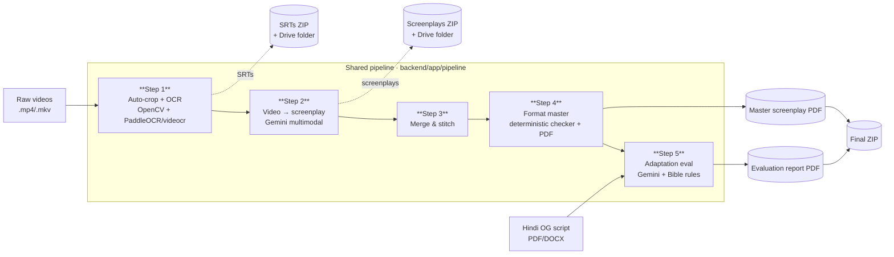
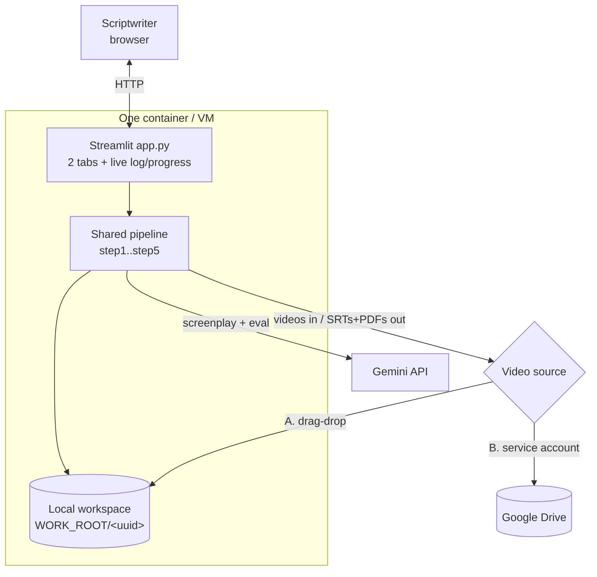
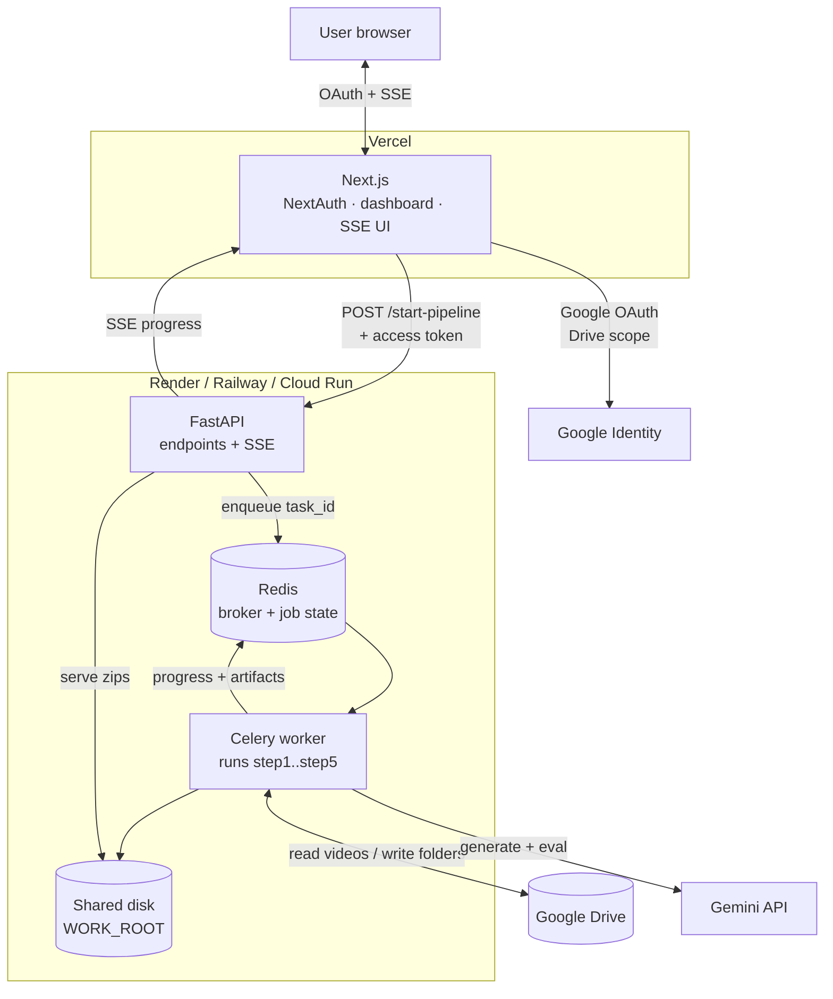
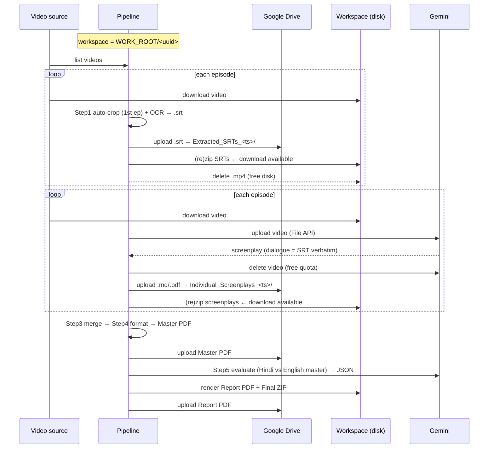

# Architecture — Microdrama Adaptation Checker (Super Model)

This tool unifies the 5 original Colab models into one automated pipeline that
turns raw **Chinese microdrama videos + a Hindi OG script** into a
**director-ready master screenplay** and an **adaptation-review report**.

There is **one shared pipeline** (`backend/app/pipeline/`) driven by **two
interchangeable front-ends**:

- **Streamlit** — one process, run the pipeline inline. Simple internal hosting.
- **Next.js + FastAPI + Celery + Redis** — multi-user product, jobs queued and
  run on background workers, live progress over SSE.

Both call the identical step functions, so the logic below is the same regardless
of how you host it.

---

## 1. The 5-step pipeline (the heart of the tool)



| Step | Module | Input → Output | Tech | From model |
|------|--------|----------------|------|-----------|
| 1 | `step1_srt.py` + `autocrop.py` | videos → `.srt` files | OpenCV auto-crop (samples mid frames, lower 30%, PaddleOCR detection → global bbox + margin), then videocr/PaddleOCR | Model 1 |
| 2 | `step2_screenplay.py` | video + SRT → per-episode screenplay (`.md`/`.pdf`) | Gemini File API (video), dialogue locked to SRT, "Beta Bana Billionaire" prompt | Model 2 |
| 3 | `step3_merge.py` | episodes → one master doc | text stitching, `EPISODE N` transitions | Model 3 |
| 4 | `step4_format.py` + `format_check.py` | master doc → formatted PDF | deterministic checker/auto-renumber + reportlab (scene left, cue ~3.7″, dialogue ~2.5″, bracketed emotion) | Model 4 |
| 5 | `step5_evaluate.py` | Hindi script + English master → report PDF | Gemini strict-JSON eval vs the "Bible" rules → color-coded PDF | Model 5 |

**Reliability built into every step:** unique UUID workspace per job, videos
deleted right after each step, Gemini files deleted after generation, `tenacity`
exponential backoff on 429s, and automatic model fallback
(`1.5-pro → 2.5-pro → 2.0-flash → 1.5-flash`).

---

## 2. Topology A — Streamlit (single process)

Simplest to host. The whole pipeline runs inside the Streamlit session; progress
is streamed into widgets by monkeypatching the state module's log/step calls.



- **Video source A**: drag-drop files → `LocalSource` (duck-types the Drive
  client) so the steps run unchanged.
- **Video source B**: Drive folder + service-account JSON → real `DriveClient`.
- One job per session, synchronous. Great for a small team.

---

## 3. Topology B — Next.js + FastAPI + Celery (multi-user product)

Handles many concurrent users and long (15–30 min) jobs without blocking HTTP.



**Request flow:**
1. User signs in with Google (Drive scope) → NextAuth stores the access token.
2. Frontend `POST /api/start-pipeline` with the Drive URL, token, and Hindi
   script → FastAPI enqueues a Celery task, returns a `task_id`.
3. Frontend opens `GET /api/task-stream/{task_id}` (SSE); the worker publishes
   progress + artifact URLs to Redis; FastAPI streams them to the browser.
4. Download buttons appear per step: **SRTs → Screenplays → Final**.

> **Shared-storage caveat:** the API serves zips the *worker* wrote. Keep both on
> one host/disk (docker-compose does), or move artifacts to S3/GCS for true
> multi-node scale-out. All artifacts also land on Google Drive regardless. (See
> the root README → "Shared storage".)

---

## 4. Module map

```
superapp/
├── backend/app/
│   ├── pipeline/                ← THE SHARED BRAIN (both front-ends use this)
│   │   ├── autocrop.py              Step 1 — OpenCV/PaddleOCR crop detection
│   │   ├── step1_srt.py             Step 1 — orchestration + Drive + zip
│   │   ├── step2_screenplay.py      Step 2 — Gemini screenplay
│   │   ├── step3_merge.py           Step 3 — stitch
│   │   ├── step4_format.py          Step 4 — checker + master PDF renderer
│   │   ├── format_check.py          Step 4 — ported Model-4 deterministic engine
│   │   ├── step5_evaluate.py        Step 5 — evaluator + report PDF renderer
│   │   ├── prompts.py               all Gemini prompts + eval JSON schema
│   │   ├── common.py                episode #, SRT parsing, filename sanitising
│   │   ├── pdf.py / textextract.py  render + extract helpers
│   ├── drive.py                  Drive client (OAuth token OR service account)
│   ├── gemini.py                 Gemini wrapper (retry + fallback + File API)
│   ├── state.py                  Redis-backed progress store (broker between API↔worker)
│   ├── tasks.py                  Celery tasks (format + full pipeline)
│   ├── main.py                   FastAPI endpoints (+ SSE)
│   ├── config.py / schemas.py / zipper.py
│   ├── Dockerfile · requirements.txt
├── frontend/                     Next.js UI (Topology B)
├── streamlit/                    Streamlit UI (Topology A) — reuses backend/app
│   ├── app.py · local_source.py · Dockerfile · requirements.txt
├── docker-compose.yml            redis + api + worker (Topology B, single host)
└── render.yaml                   Render blueprint (Topology B)
```

---

## 5. Data & artifact flow



---

## 6. Tech stack

| Layer | Choice |
|-------|--------|
| Streamlit front-end | Streamlit 1.40 |
| Product front-end | Next.js 14 (App Router), NextAuth, Tailwind, framer-motion, shadcn-style UI |
| API | FastAPI + Server-Sent Events |
| Task queue / state | Celery + Redis |
| Multimodal + LLM | Google Gemini (`gemini-1.5-pro` + fallbacks), `tenacity` retry |
| OCR / vision | PaddleOCR + `videocr`, OpenCV (auto-crop) |
| Documents | reportlab (PDF), pdfplumber + python-docx (extract) |
| Storage | Google Drive (via user OAuth token or service account) + local workspace |
| Packaging | Docker, docker-compose, render.yaml; Vercel for the Next.js UI |
```
